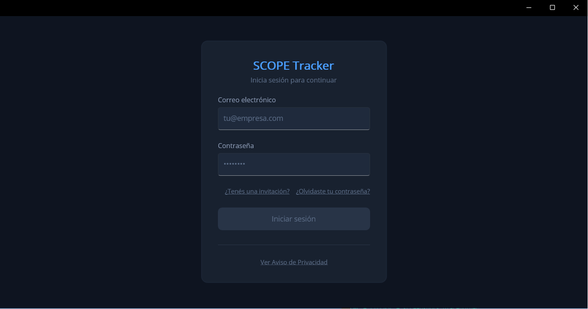
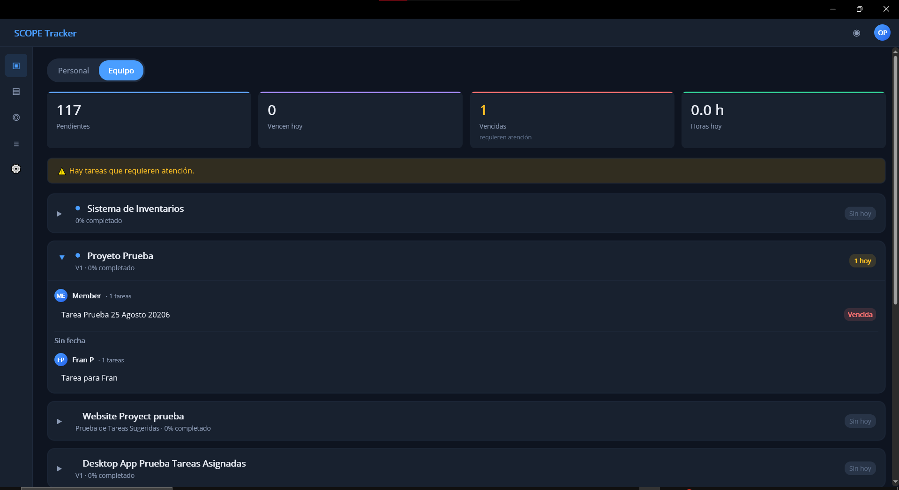
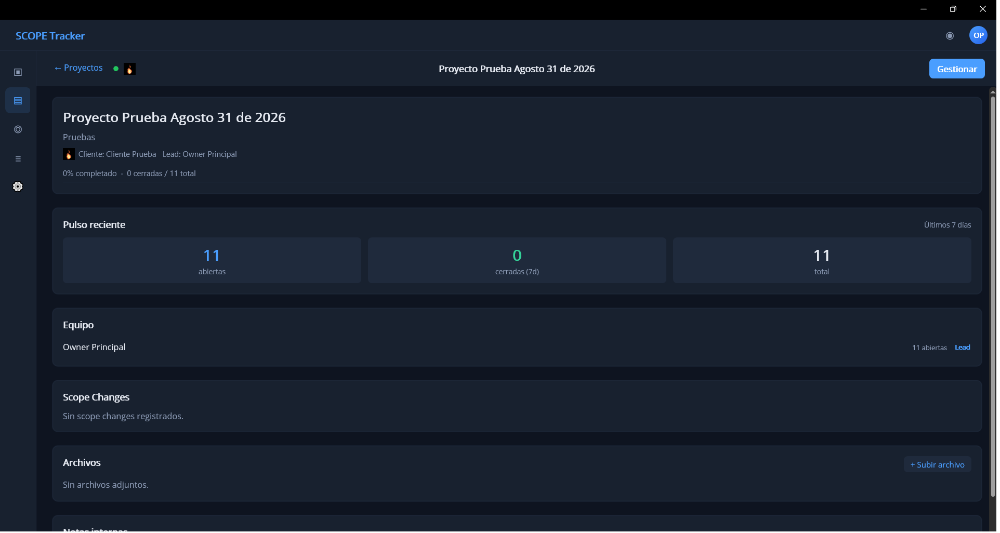
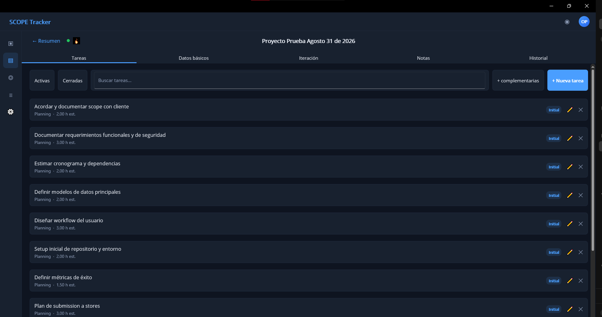
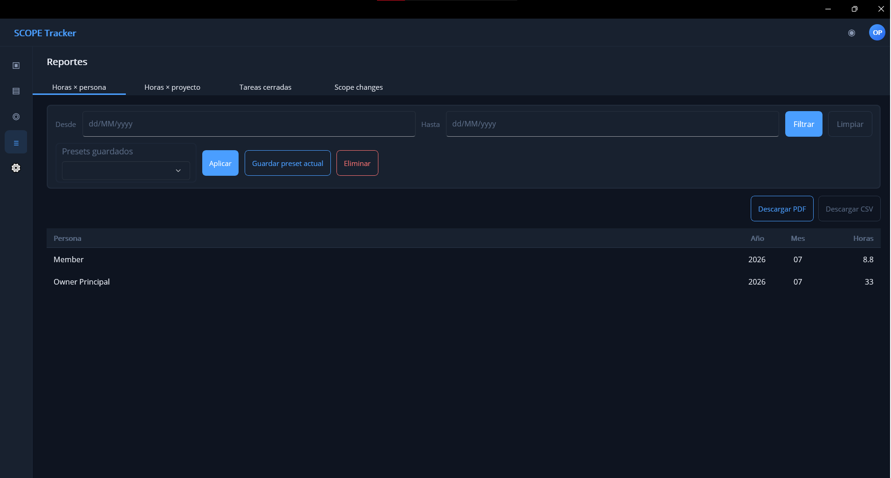
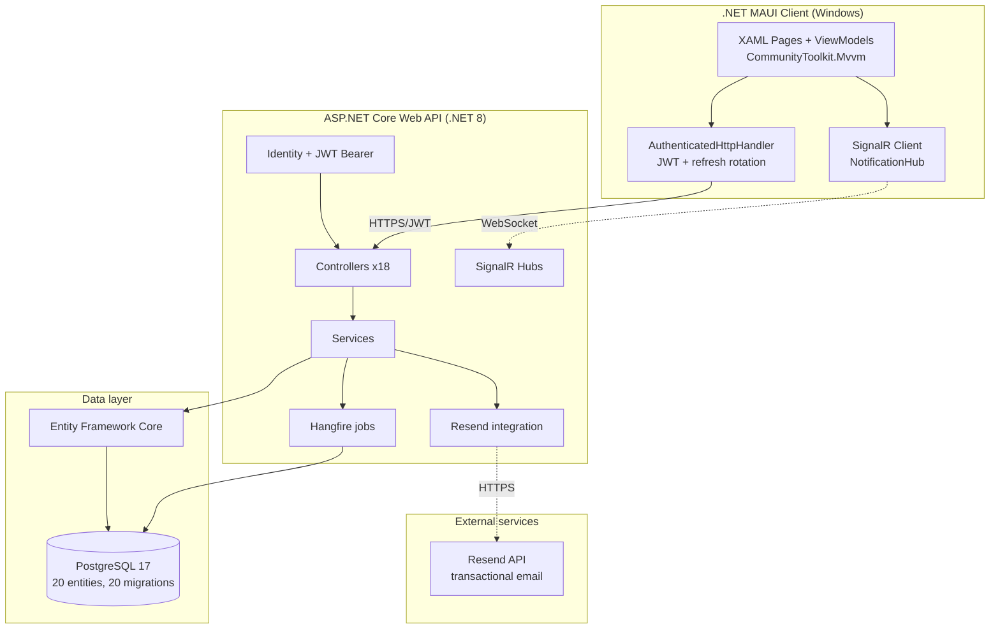

# SCOPE Tracker — Case Study

**Case study of an internal project-tracking tool for a small software consultancy.** Native Windows desktop client backed by an ASP.NET Core Web API, PostgreSQL/EF Core, real-time notifications, background jobs and transactional email. Built solo, in production against real users since Phase 1.5 closed on 2026-08-26.

This repository documents the system: its architecture, technical decisions, key metrics, screenshots and a short video walkthrough. The full source code and internal design documentation are private and available on request.

---

## Video walkthrough

A 4:37 min walkthrough of the running system in dev environment with dummy demo data: login, dashboard, project creation, task management, in-app real-time notification and user invitation flow (triggers a transactional email). Hosted on YouTube as an unlisted video — accessible with the link only.

---

## Overview

**Problem.** A two-founder consultancy that ships software to SMBs needs to track projects across the Lean MVP Cycle stages, capture real hours per task, record scope changes with commercial context, and produce reports for internal use. Off-the-shelf tools either did not fit the workflow or required commercial information to live in a billing system the consultancy did not want to run.

**Users.** Two founders (Owner role), plus room for additional Members and Contributors per project. Client-facing role deferred to a future phase.

**Non-goals.** Not a billing system. Prices and expenses are captured but never invoiced from the app; that lives in another tool in the client's flow.

---

## Screenshots

Screenshots below are from the app running in dev environment with dummy demo data (Dark theme).

### Login

### Dashboard — team view

### Project summary

### Project management — Tasks tab

### Reports

---

## Architecture

**Solution structure** (5 main projects + 3 test projects):

- `ScopeTracker.Server.Api` — ASP.NET Core Web API host.
- `ScopeTracker.Client.Maui` — .NET MAUI desktop client (Windows-first, extensible to macOS/Android).
- `ScopeTracker.Client.Services` — portable class library (net8.0) with auth, HTTP, storage and view-models — independent of the MAUI UI framework, testable without a MAUI host.
- `ScopeTracker.Shared` — DTOs and shared contracts.
- `ScopeTracker.Data` — EF Core entities, `DbContext`, entity configurations, migrations, seed data.
- `ScopeTracker.*.Tests` — xUnit projects for server, client and data layers.

---

## Technical decisions

The full decision log lives in a private `DESIGN_DECISIONS.md` in the source repository (24 numbered sections). A few decisions worth calling out publicly:

- **`AddIdentityCore` with JWT Bearer, no cookie schemes.** The client is native, not browser-based. The default `AddIdentity` pipeline adds cookie authentication that would be dead weight and confuse the auth flow. `AddIdentityCore` gives Identity's `UserManager` and password hashing without the cookie stack.
- **Refresh token rotation.** Access tokens are short-lived (60 min); refresh tokens are 64 random bytes stored server-side and rotated on every refresh. Compromise of a refresh token is detectable because the previous token stops working on the next legitimate refresh.
- **No repository pattern, no Unit of Work.** `DbContext` is already both. Services depend on `DbContext` directly and use LINQ. Fewer abstraction layers, less test-only code, EF Core query filters cover soft delete globally.
- **Mapster over AutoMapper.** Faster startup, less verbose configuration, no runtime reflection for the common cases.
- **Testcontainers for integration tests that need PostgreSQL.** The InMemory provider silently ignores FK `Restrict`, `UNIQUE` constraints and PostgreSQL-specific behavior — bugs detected empirically during development. Integration tests that need a real database boot a PostgreSQL 17 container per test class via Testcontainers; the rest use InMemory for speed.
- **Hangfire on PostgreSQL for background jobs.** No Redis dependency. Recurring purge of notifications older than 30 days runs at `0 3 * * *` UTC. Disabled in the `Testing` environment.
- **Resend for transactional email via raw `HttpClient` through `IHttpClientFactory`.** No SDK dependency; the Resend REST surface used is small (one POST). `SendAsync` catches HTTP failures, logs a warning and returns `false` — secondary-channel failures never take down the primary request.
- **Self-signed MSIX packaging.** MVP cert is self-signed with a script; the installer script signs the package. Production distribution to end users would swap the cert for a real code-signing certificate.
- **Mandatory human click-through before closing any UI-touching unit.** Documented in the AI-assisted methodology (see below). Every UI change is validated by a human clicking through the affected screens before the unit is marked closed, on top of the automated test suite.

---

## Verifiable metrics

As of the last release cut (Phase 1.5 closure, 2026-08-26):

| Metric | Value |
|---|---|
| Solution projects | 5 source + 3 test |
| Domain entities (EF Core) | 20 |
| Schema migrations applied | 20 |
| REST controllers | 18 |
| Automated test attributes | 800+ across 84 files |
| Task template rows seeded | 258 (143 core + 115 complementary across 7 Lean MVP stages) |
| Notification event types active | 5 |
| Production deployment | VPS Ubuntu with HTTPS (Let's Encrypt), MSIX-packaged client |
| Real users on production | Yes, active |

**Timeline:**

- **MVP shipped** — 2026-07-01 (Sprint 11 closed, MVP go-live ready).
- **Phase 1.5 closed** — 2026-08-26 (polish, tech debt cleanup, email-domain features including password reset, in-app + email notifications, and user invitation flow, verified end-to-end against real users and real email).
- **Phase 2 in execution** — since 2026-09-01 (5 blocks planned, ~26-34 weeks).

---

## Technology stack

| Category | Technology |
|---|---|
| Language | C# on .NET 8 LTS |
| Client | .NET MAUI (Windows-first) |
| Server | ASP.NET Core Web API |
| Database | PostgreSQL 17 with Entity Framework Core |
| Auth | ASP.NET Core Identity + JWT Bearer tokens with refresh rotation |
| Real-time | SignalR |
| Background jobs | Hangfire on PostgreSQL |
| Transactional email | Resend |
| PDF generation | QuestPDF |
| DTO mapping | Mapster |
| Logging | Serilog (console + rolling file) |
| Testing | xUnit + Testcontainers (PostgreSQL 17 in Docker for integration tests) |
| Packaging | MSIX (Windows) |
| Deployment | Ubuntu VPS with Nginx reverse proxy, Let's Encrypt, UFW + Fail2ban, systemd timer for backups |

---

## AI-assisted development

SCOPE Tracker was built solo, using AI coding assistants throughout, following a reusable methodology developed in parallel. The methodology formalizes a four-actor model:

- **Human Operator** — decides, ratifies, executes commands.
- **Planner** — strategic planning agent, defines scope and sequence per phase.
- **Reviewer** — tactical peer-audit agent, audits plans pre-execution and results post-execution.
- **Implementer** — coding agent with toolchain access, executes ratified units.

The four actors coordinate exclusively through versioned files (handoffs, backlog, design decisions), never directly agent-to-agent. Guardrails include verify-before-affirm discipline, per-command timestamp discipline, an empirically-derived instrument-failure taxonomy, and mandatory human click-through before closing any UI-touching unit.

Eight empirical refinements to the methodology were documented across real-world usage during Phase 1 and Phase 1.5, and folded back into the master kit. The methodology is available for consultation on request.

---

## Full source code

The complete source repository is private. Read access can be granted on request for interview or evaluation purposes.

---

## License

This case study documentation is licensed under [MIT](LICENSE). Applies to the content of this repository (README, diagrams, screenshots), not to the underlying source code of SCOPE Tracker, which is governed separately.

---

## Author

**Francisco Iván Coronado Pontón** — Software Engineer

- Email: francisco.ponton0@gmail.com
- LinkedIn: [linkedin.com/in/francisco-ponton/](https://linkedin.com/in/francisco-ponton/)
- Location: Ciudad de México, MX
